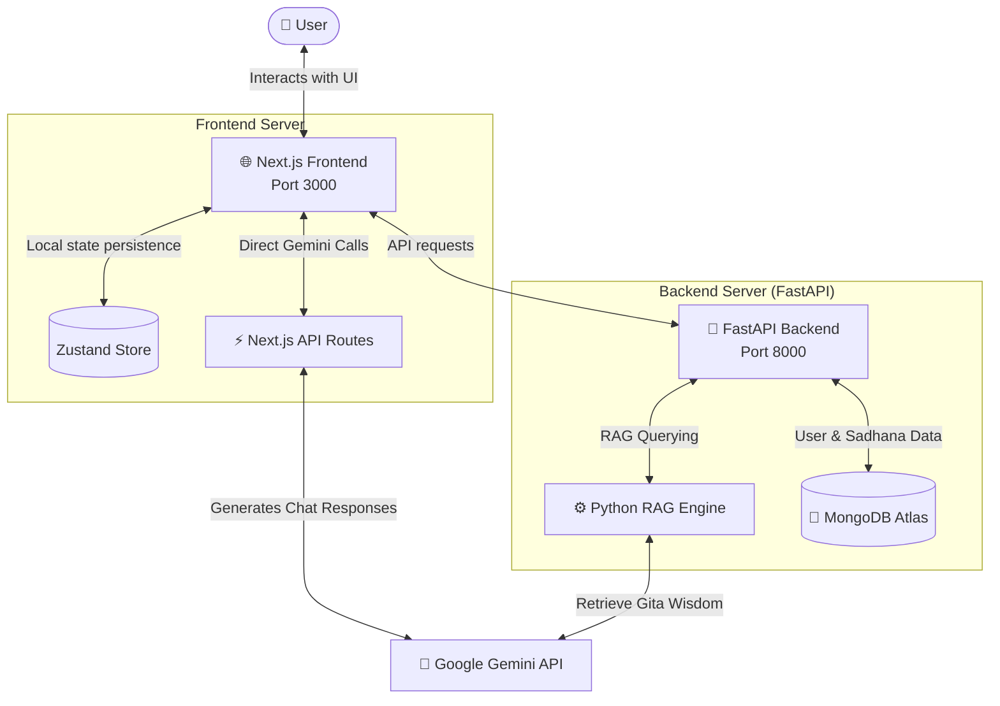

# 🪷 Gita Mentor AI

> **Ancient Wisdom. Modern Life. Infinite Peace.**

Gita Mentor AI is a full-stack, AI-powered spiritual guidance platform based on the teachings of the **Bhagavad Gita**. The application bridges the gap between ancient philosophy and contemporary challenges, offering users a compassionate, conversational AI guide modeled after Krishna's mentorship to Arjuna.

This project is built using a modern **Next.js 14** App Router frontend combined with a lightweight **FastAPI (Python)** backend, leveraging **Google Gemini AI** and a custom **RAG (Retrieval-Augmented Generation)** architecture.

---

## 🔮 System Architecture



---

## ✨ Features

- **🤖 Compassionate AI Chat**: Converse with the Gita Mentor, programmed with a warm, wise, and philosophical persona to help navigate life's questions.
- **📖 Bhagavad Gita Verse Library**: Seamlessly browse, search, and reflect on the key teachings of the Gita.
- **🧘 Sadhana & Mindfulness**: (In development) Interactive features including daily streak systems, habit trackers, and a guided meditation timer.
- **💾 Local State Persistence**: Client-side chat history and UI settings persist locally using Zustand middleware.
- **⚡ Advanced RAG Backend**: A structured FastAPI service with a custom Python-based Retrieval-Augmented Generation (RAG) engine powered by Gemini.

---

## 🛠️ Tech Stack

### Frontend (Root Level)
* **Framework**: Next.js 14 (App Router, React, TypeScript)
* **Styling**: TailwindCSS with premium spiritual-themed design tokens and typography
* **Animations**: Framer Motion (for smooth micro-animations and page transitions)
* **State Management**: Zustand (with local storage persistence)
* **API Integration**: `@google/generative-ai` SDK

### Backend (Python/FastAPI)
* **Web Framework**: FastAPI (Uvicorn server)
* **AI Engine**: Google Generative AI Python SDK (`google-generativeai`)
* **Database Driver**: Motor + PyMongo (Asynchronous MongoDB connection)
* **Settings Management**: Pydantic v2 & `python-dotenv`

---

## 📁 Project Structure

```text
gita-project/
├── app/                  # Next.js App Router (Frontend Pages & Layouts)
│   ├── api/chat/         # Next.js Serverless API Chat Route (Direct Gemini SDK)
│   ├── chat/             # Chat User Interface
│   ├── globals.css       # Custom CSS variables, themes, and animations
│   └── page.tsx          # Landing / Entry Page
├── components/           # Reusable React components
│   └── ui/               # Custom UI Components (Navbar, etc.)
├── lib/                  # Frontend libraries and state management
│   └── store.ts          # Zustand store for chat and user session tracking
├── api/                  # FastAPI Backend Routers
│   ├── chat.py           # Chat/Ask API router using RAG Engine
│   ├── verses.py         # Verses metadata & content router
│   ├── users.py          # User management router
│   └── tasks.py          # Daily tasks / Sadhana tracker router
├── core/                 # Backend Core Logic
│   └── rag_engine.py     # Custom RAG engine powered by Gemini AI
├── services/             # Backend Services
│   └── mongodb.py        # Asynchronous MongoDB Atlas connection initializer
├── main.py               # FastAPI application entry point
├── requirements.txt      # Python dependencies
├── package.json          # Node.js frontend dependencies
└── .gitignore            # Comprehensive environment & cache ignores
```

---

## 🚀 Quick Start & Installation

To run this application locally, you will need to set up both the Next.js frontend and the FastAPI backend.

### Prerequisites
* **Node.js** (v18.x or higher)
* **Python** (v3.10 or higher)
* **MongoDB** (Atlas cluster or local instance)
* **Google Gemini API Key** (obtainable from [Google AI Studio](https://aistudio.google.com/))

### 1. Set Up Environment Variables
Create a `.env` file in the **root** directory of the project:

```env
# Google Gemini API
GEMINI_API_KEY=your_gemini_api_key_here
GEMINI_MODEL=gemini-1.5-flash

# MongoDB Configuration
MONGODB_URI=your_mongodb_connection_uri_here
MONGODB_DB=gita_mentor

# Backend Configuration
PORT=8000
CORS_ORIGINS=http://localhost:3000
ENV=development
```

> [!IMPORTANT]
> The `.env` file contains sensitive credentials. It is automatically excluded from git tracking via `.gitignore`. Never commit this file to public repositories.

---

### 2. Launch the Frontend (Next.js)

Open your terminal at the root of `gita-project/`:

```bash
# Install dependencies
npm install

# Start Next.js Development Server
npm run dev
```
The frontend will be running at [http://localhost:3000](http://localhost:3000).

---

### 3. Launch the Backend (FastAPI)

Open a new terminal window at the root of `gita-project/`:

```bash
# 1. Create a Python Virtual Environment
python -m venv venv

# 2. Activate the Virtual Environment
# On Windows (PowerShell):
venv\Scripts\Activate.ps1
# On macOS/Linux:
source venv/bin/activate

# 3. Install Python dependencies
pip install -r requirements.txt

# 4. Start the FastAPI server
python main.py
```
The FastAPI backend server will be running at [http://localhost:8000](http://localhost:8000). 
You can view the interactive API documentation (Swagger UI) at [http://localhost:8000/docs](http://localhost:8000/docs).

---

## 🗺️ Roadmap & Next Steps

This project is a hybrid workspace. While the Next.js chat interface works directly out of the box using built-in API routes, the FastAPI backend is designed for scaling the app:
1. **RAG Expansion**: Enhance `core/rag_engine.py` to index local Bhagavad Gita translation files and query them contextually before asking Gemini.
2. **MongoDB Data Sync**: Connect the frontend Zustand store with the FastAPI user database (`api/users.py`) for cloud-based profile management.
3. **Sadhana System**: Complete implementation of `api/tasks.py` to store daily routines and streaks in the database.

---

## 🙏 Quote & Inspiration
> *"Yoga is the journey of the self, through the self, to the self."* — **Bhagavad Gita 6.20**